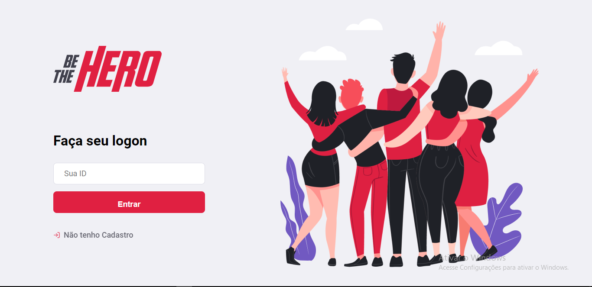
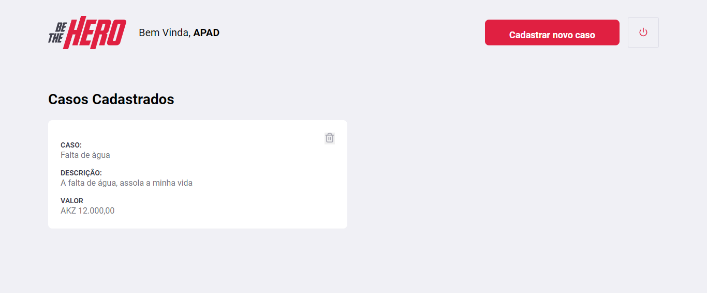
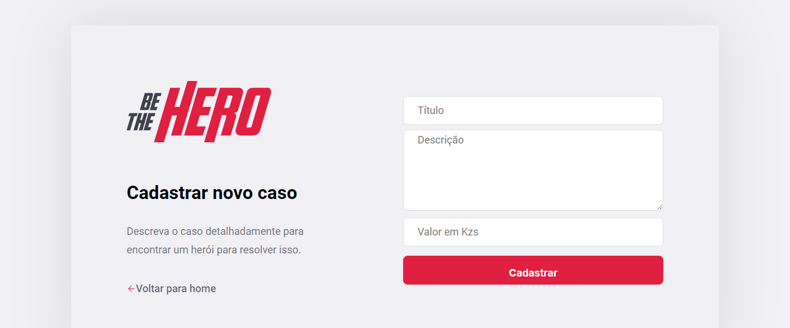

<h1 align="center">
    BeTheHero
</h1>

<h4 align="center">
  🚀 Semana OmniStack 11.0
</h4>

  <a href="#rocket-tecnologias">Tecnologias</a>&nbsp;&nbsp;&nbsp;|&nbsp;&nbsp;&nbsp;
  <a href="#-projeto">Projeto</a>&nbsp;&nbsp;&nbsp;|&nbsp;&nbsp;&nbsp;
  <a href="#-layout">Layout</a>&nbsp;&nbsp;&nbsp;|&nbsp;&nbsp;&nbsp;
  <a href="#-como-contribuir">Como contribuir</a>&nbsp;&nbsp;&nbsp;|&nbsp;&nbsp;&nbsp;
  <a href="#memo-licença">Licença</a>

 

  

  

  

## :rocket: Tecnologias

Esse projeto foi desenvolvido com as seguintes tecnologias:

- [Node.js](https://nodejs.org/en/)
  - [Express]()
  - [Jest]()
  - [Celebrate]()
  - [sqlite]()
  - [knex]()
- [React](https://reactjs.org)
  - [React-router-dom]()
  - [React-icons]()
  - [Unform-Rocketseat]()

## 💻 Projeto

O Be-The-Hero é um projecto que visa Ong's se cadastrarem e postarem alguns incidentes e o valor para poderem solucionar o problema. Assim outras pessoas ou empresas poderão ver os incidentes e ajudar!

## :memo: Licença

Esse projeto está sob a licença MIT. Veja o arquivo [LICENSE](LICENSE.md) para mais detalhes.

---

Feito com ♥ by Jmamadeu - (Mateus Aalexandre) :wave:
